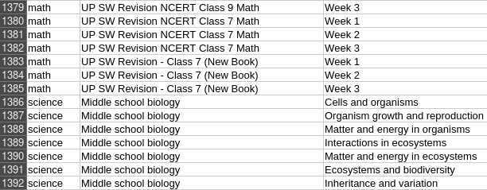
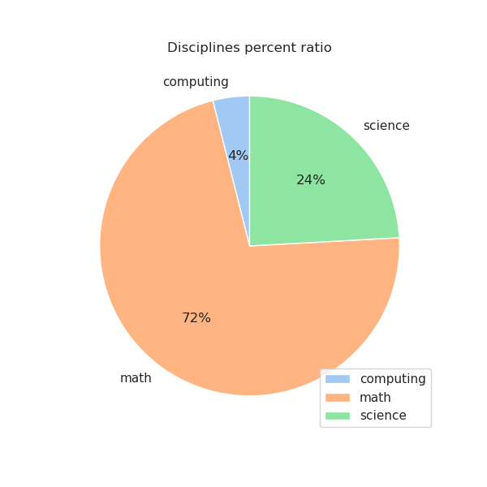
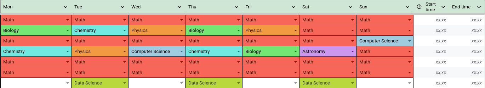

# About



This exctraction data project made for personal use with the goal to make effective study schedule based on the ratio of disciplines.

# How to setup
1. Enter the project directory:

```bash
cd lessons-dataset-fetcher
```

2. Use `conda` to setup environment:

```bash
conda env create -f environment.yml
```

or, create virtual environment `python -m venv .venv` and activate, then use pip 

```bash
pip install -r requirements.txt
```

3. Create a directory for the table: 

```bash
mkdir table
```

4. Run `prep.py` to get data.

```bash
python -m prep
```

5. Finally, if you want some visuals you can run `viz.py`, it'll show a figure with a pie chart could be saved locally.

```bash
python -m viz.py
```

# Showcase


*Pie chart of disciplines percent ratio*

[](./resources/Schedule.pdf)
*Study schedule made on basis of the pie chart*


*Proof screenshot of the resulting dataset*